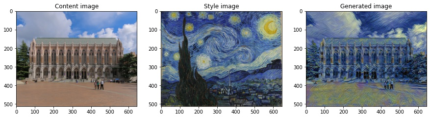
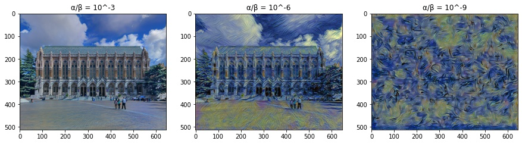

# CSE 455 Final Project

## Problem Statement

In this project, we look at the problem of Neural Style Transfer. In the Neural Style Transfer problem, we have two input images, a content image and a style image. The goal is to take the "style" of the style image and apply it on our content image using Convolutional Neural Networks. 

We first took a look at the paper and play around with the implementation from Gatys *et al.*, A Neural Algorithm of Artistic Style, 2015 which uses transfer learning by using pretrained VGG-19. We then make some modifications to the reference implementation and try exploring the impact of the parameters such as the weighting between style and content or how the style weighting on shallow or deep layers of the network may affect the results. Finally, we compare and see how the results differ when when we use a different and much smaller network, i.e., Darknet instead of VGG, to the transfer learning process.

## Data

We use [image of the UW Suzzallo Library](https://upload.wikimedia.org/wikipedia/commons/1/10/MK03214_University_of_Washington_Suzzallo_Library.jpg) and [image of The Starry Night by Van Gogh](https://www.vangoghgallery.com/img/starry_night_full.jpg) which are available via the links. They are cropped and resized to the same width and height dimensions.

## Method/Results

Neural Style Transfer tries to minimize a loss function comprised of two terms, a content loss and a style loss. The content loss is rather straightforward - it's just the mean squared error of the feature map between the content image and generated image at a specific layer in the pretrained VGG-19 network. 

For the style of an image, we first compute Gram matrices using different feature maps in the VGG-19 network. We concatenate the set of Gram matrices which then represent the style of an image. This is because the Gram matrix represent the covariance between different features/textures for a single layer. Basically, it shows which features are likely or unlikely to occur together, which is representative of the style. We then take the concatenated Gram matrices for different layers in the content image and generated image and compute the mean squared error.

The following experiments are done based on the [reference implementation](https://pytorch.org/tutorials/advanced/neural_style_tutorial.html) of the paper from Gatys *et al.*, A Neural Algorithm of Artistic Style, 2015. We take an image of the UW Suzzallo Library as the content image, the Van Gogh painting The Starry Night as the style image, and we get the generated image on the right after running 300 iterations of gradient descent.

We then try tweaking the weighting between the content and style losses. α represents the weighting of the content loss while β represents the weighting of the style loss. Previously, we set α/β = 10^-6. As we can see in the experiment below, when α/β is small, most of the content image is preserved, while with large α/β, we lose almost all of the details of the structure in the content image and only the wavy patterns are left.

Next, we change the the layers in which the style loss function is computed for. (As a side note, the content loss is set to the 4th convolutional layer.) Previously, we used the first five convolutional layers of the VGG-19 network in the style loss. We compare that to using the first convolutional layer and the fifth convolution layer in the style loss function. We can see that when using only the first layer (left image), the generated image is mostly just tinted blue, so we can reasonably guess that the first convolutional layer in the network mostly detects colors. If we only use the fifth layer (right image), the generated image contains a lot of wavy brushstrokes, so we can infer that the 5th convolutional layer detects wavy patterns. When using the set of the first five convolutional layers together (center image), we see a nice blend of the blueish colors as well as the wavy brushstrokes in the generated image.

Finally, we use a modified version of the Darknet discussed in class instead of the pretrained VGG-19 network. Note that the Darkent is a MUCH smaller network which contains 5 convolutional layers with ReLU as the activation function and max pooling layers in between. We load the [here](https://pjreddie.com/media/files/checkpoint-19.pkl) which was pretrained on ImageNet. It is hard to get Darknet to mimic the wavey patterns of the style image despite putting a lot of weight on the style loss which is probably due to its small network size which could result in capturing such wavey features poorly. Nonetheless, it is interesting to look at the generated image of such a small network compared to that of VGG-19. Here, we set α/β = 10^-8. 

### Code

All of the code is in this [Google Colab notebook](https://colab.research.google.com/drive/1oPPeeOegthasYOR0HzXxBOoBcRcUtRux?usp=sharing)

## Summary

In this project, we covered Neural Style Transfer. We studied the original paper and modified the reference implementation, evaluated the impact of values for different parameters, and experimented with the loss function on different layers of the network. Finally, we switched from using VGG-19, which was used in the original paper, to a much smaller network Darknet and compared the results.

## References

- Gatys *et al.*, A Neural Algorithm of Artistic Style, 2015

- [Neural Style Transfer implementation](https://pytorch.org/tutorials/advanced/neural_style_tutorial.html)

- [Darknet reference](https://pjreddie.com/darknet/imagenet/#reference)
